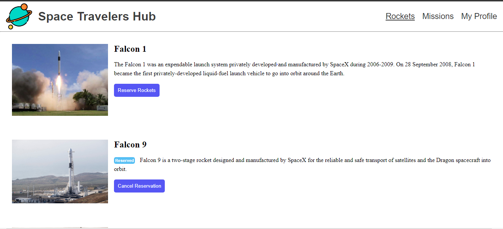

<a name="readme-top"></a>


# 📗 Table of Contents

- [📗 Table of Contents](#-table-of-contents)
- [📖 Space Mission App ](#-space-mission-app-)
  - [🛠 Built With ](#-built-with-)
    - [Tech Stack ](#tech-stack-)
  - [💻 Getting Started ](#-getting-started-)
    - [Prerequisites](#prerequisites)
    - [Key Features ](#key-features-)
  - [🚀 Live Demo ](#-live-demo-)
  - [💻 Getting Started ](#-getting-started--1)
    - [Prerequisites](#prerequisites-1)
    - [Setup](#setup)
    - [Install](#install)
    - [Usage](#usage)
    - [Run tests](#run-tests)
    - [Deployment](#deployment)
  - [Authors](#authors)
  - [👥 Author ](#-author-)
  - [🔭 Future Features ](#-future-features-)
  - [🤝 Contributing ](#-contributing-)
  - [⭐️ Show your support ](#️-show-your-support-)
  - [🙏 Acknowledgments ](#-acknowledgments-)
  - [📝 License ](#-license-)

<!-- PROJECT DESCRIPTION -->

# 📖 Rocket Space Mission App <a name="about-project"></a>

**Space Mission App** is a React project with Redux. Minimal app that fetches data from SpaceX API and display missions and rockets details. Project is developed for Microverse React Group project task.



## 🛠 Built With <a name="built-with"></a>

### Tech Stack <a name="tech-stack"></a>

<details>
  <summary>Build With</summary>
  <ul>
    <li><a href="https://html.com/">HTML</a></li>
    <li><a href="https://developer.mozilla.org/en-US/docs/Web/CSS">CSS</a></li>
    <li><a href="https://www.javascript.com/">JavaScript</a></li>
    <li><a href="https://reactjs.org/">React.js</a></li>
  </ul>
</details>

## 💻 Getting Started <a name="getting-started"></a>

To get a local copy up and running, follow these steps.

- Clone the Repo or Download the Zip file or `https://github.com/Sammy3000/React-Rocket-Mission.git`
- cd /rocket-mission-react
- `npm install` To download all the dependancies of the project
- Use `npm start` to run the app in your browser

### Prerequisites

In order to run this project you need:

- Git/Github
- React, Redux, HTML,CSS knowledge.
- VS code or any other equivalent tool.

### Key Features <a name="key-features"></a>

- **Fetching data from Api with createAsyncThunk and render on pages**

<p align="right">(<a href="#readme-top">back to top</a>)</p>

## 🚀 Live Demo <a name="live-demo"></a>

- See it live by clicking [Live Demo Link](https://rocket-mission-hpre.onrender.com)

<p align="right">(<a href="#readme-top">back to top</a>)</p>

## 💻 Getting Started <a name="getting-started"></a>

### Prerequisites

In order to run this project you need: a properly working pc or laptop and a modern web browser.

### Setup

Clone this repository to your desired folder:

```sh
  cd my-folder
  git clone https://github.com/Sammy3000/React-Rocket-Mission.git
```

### Install

Install this project with:

```sh
  cd my-folder
  git clonehttps://github.com/Sammy3000/React-Rocket-Mission.git
  npm install
```

### Usage

Use this app by runing:

```sh
  cd my-folder
  git clone https://github.com/Sammy3000/React-Rocket-Mission.git
  npm install
  npm start
```

### Run tests

Test this app by runing:

```sh
  cd my-folder
  git clonehttps://github.com/Sammy3000/React-Rocket-Mission.git
  npm install
  npm test
```

### Deployment

You can deploy this project using: GitHub but if you want to deploy make sure you let me know first :3

<p align="right">(<a href="#readme-top">back to top</a>)</p>

## Authors

## 👥 Author <a name="author"></a>

👤 **Rachel Isaac**

- GitHub: [@rachelwebdev](https://github.com/Rachelwebdev)
- Twitter:[@rachelisaac13](https://twitter.com/Rachelisaac13)
- LinkedIn: [Rachel Isaac](https://www.linkedin.com/in/rachelisaac13/)

👤 **Towett Sammy**

- GitHub: [@sam](https://github.com/Sammy3000)
- Twitter: [@towettsam](https://twitter.com/sammy15375658)
- LinkedIn: [@towettSammy](https://www.linkedin.com/in/towett-sammy-43476024a/)

<p align="right">(<a href="#readme-top">back to top</a>)</p>

## 🔭 Future Features <a name="future-features"></a>

- [ ] **Add extra pages**
- [ ] **Add a dark and light mode**
- [ ] **Make it responsive**

<p align="right">(<a href="#readme-top">back to top</a>)</p>

## 🤝 Contributing <a name="contributing"></a>

Contributions, issues, and feature requests are welcome!

Feel free to check the [issues page](https://github.com/Sammy3000/React-Rocket-Mission.git).

<p align="right">(<a href="#readme-top">back to top</a>)</p>

## ⭐️ Show your support <a name="support"></a>

Give a ⭐️ if you like this project and share it with your friends.

<p align="right">(<a href="#readme-top">back to top</a>)</p>

## 🙏 Acknowledgments <a name="acknowledgements"></a>

- I would like to thank my Microverse partners.

<p align="right">(<a href="#readme-top">back to top</a>)</p>

## 📝 License <a name="license"></a>

This project is [MIT](./LICENSE) licensed.

<p align="right">(<a href="#readme-top">back to top</a>)</p>
